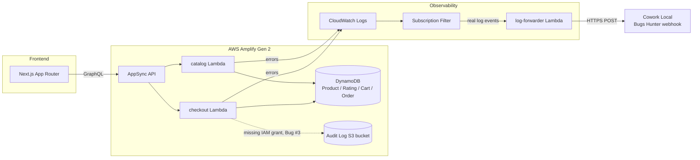

# QuickCart

A tiny AWS Amplify Gen 2 e-commerce demo (Next.js + Lambda + DynamoDB) that
ships its own real production bugs. Each one fires a real error from a real
Lambda, which streams out of CloudWatch Logs into
[Cowork Local](../CoworkHackathon)'s Bugs Hunter tab for live AI incident
analysis.

The product specification lives in [`documents/`](documents/) (English,
Vietnamese and Japanese) — that is the context the analyser is given, and it
describes the intended behaviour only.

## Architecture



## Quickstart

```bash
npm install
npx ampx sandbox            # provisions a real (disposable) backend in your AWS account
npx tsx scripts/seed.ts      # seed ~32 demo products (deploys seed themselves)
npm run dev                  # http://localhost:3000
```

Then open `/admin/chaos`. Each entry either drives the real storefront until
the defect happens on screen, or calls the backend directly.

Deploy and CI/CD notes are kept in `docs/`, which is deliberately not tracked
in this repository — see `.gitignore`.

## Project layout

```
amplify/            Amplify Gen 2 backend (CDK under the hood)
  backend.ts         entry point — wires auth/data/functions + monitoring
  data/resource.ts    DynamoDB models (Product, Rating, Cart, Order) + custom
                      checkout/getCatalog operations backed by Lambda
  functions/          checkout, catalog, log-forwarder
  monitoring.ts       CloudWatch Logs subscription filters -> log-forwarder (CDK)
app/                 Next.js App Router frontend (catalog, cart, checkout,
                     /admin/chaos "Chaos Panel")
documents/           product specification (en/vi/ja) — the analyser's context
.github/workflows/   GitHub Actions: push to main -> ampx pipeline-deploy
```
